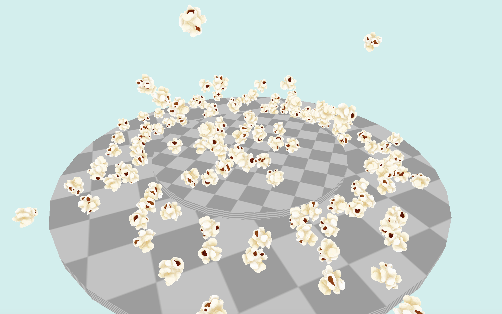
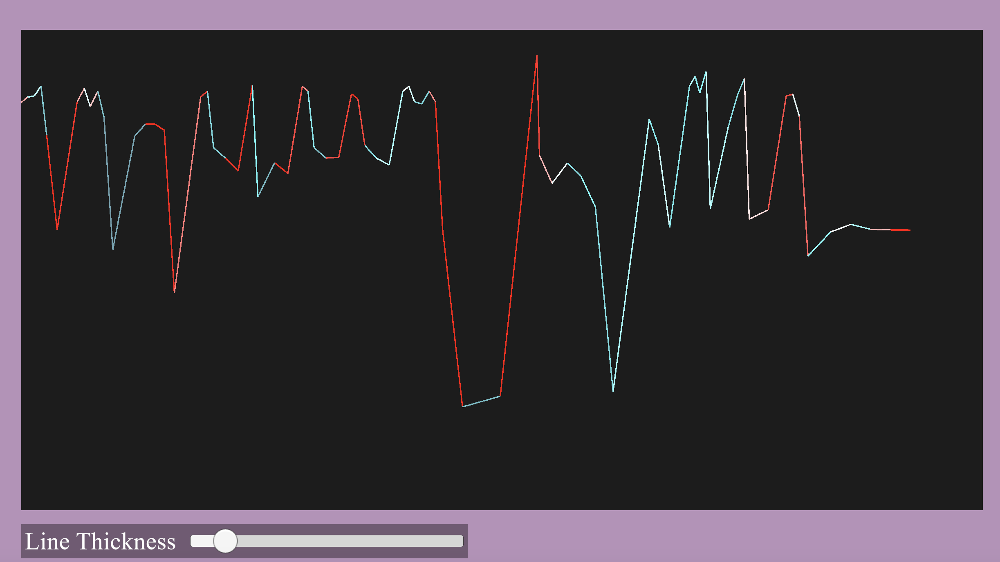
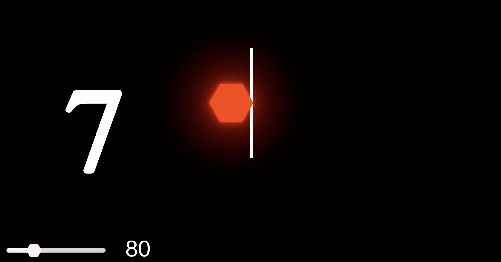

# VESPer


**VESPer** stands for Visual Expression with Sensory Percussion. It was developed for the paper Exploring Real Time Interfaces with Sensory Percussion and is intended for use alongside [EVANS Hybrid Sensory Percussion](https://sunhou.se/sensorypercussion) by Sunhouse and EVANS.

## Requirements

The Unity project was original created in version `2022.3.25f1`. It has since been updated to a Unity 6 version following security patches. You will need to be able to open and run Unity projects to use this repository.

For the most complete experience, users will need the EVANS Hybrid Sensory Percussion system, the Sensory Percussion 2 software, and one snare drum.

In lieu of Sensory Percussion 2, users can use [MaxMSP](https://cycling74.com/products/max) and the provided patch to send OSC messages. The Unity project also supports the use of the space key as a drum hit in the center of the head with a velocity of `0.5` (or `64` in MIDI terms) for testing purposes.

## Quickstart

### For all users

If you are using Sensory Percussion, follow the following sequence:
1. Turn on your Sensory Percussion unit.
2. Open the `mapping.sp2` file included in this repository.


3. Open the Unity project and launch the `Assets/Scenes/Demo/Menu` scene.


4. Synchronize your OSC port. To do this, open the settings page in the demo menu. Copy the value labeled "port" to the "remote port" field on the Sensory Percussion 2 OSC settings page:


(You can also change your port in the demo menu, but be aware that it will not update until you open one of the demos from the menu.)

When properly synchronized, tapping the center of your drum lightly should move between the different highlighted buttons on the main menu. You can also navigate using the mouse and keyboard. When using a demo, hitting the shell of the drum or pressing the ESC key will take you back to the main menu.

**If you do not have Sensory Percussion, you can still demo this repository!** Use the [MaxMSP](https://cycling74.com/products/max) patch included to send messages as if using a Sensory Percussion setup, or just use the space bar to simulate a drum in most scenes!

### For developers

`Assets/Scenes/Starter Pack` contains the basic elements required in a scene:
- An object with the OSC script attached (available as a prefab at `Assets/Prefabs/OSC`)
- An object with an input handler attached.
  - `InputHandler_Generic.cs` is the class from which all other input handlers inherit.
  - The function `InputHandler` is where you will process most user input. `InputHandler` takes as input the following parameters:
    - `string command`, typically `play`, `stop`, or `cc`
    - `float velocity`, which ranges from 0.0 to 1.0
    - `int note`, a MIDI note number
    - `long time`, the time in ticks since the OSC class was initialized (useful for precise timing)

To add an action when the drum is hit, create a new input handler script and add a function call inside the `InputHandler` function, or modify it directly. Compare `InputHandler_Generic` with `InputHandler_Grapher` for an example:

```C#
//InputHandler_Generic.cs

protected virtual void InputHandler(string command, float velocity, int note, long time) {
    Debug.Log("If you see this, you have a child class that needs to override this method.");
    Debug.Log($"Message: {command} {velocity} {note}");
}


//InputHandler_Grapher.cs

protected override void InputHandler(string command, float velocity, int note, long time) {
    if (command.Equals("play")) {
        myGrapher.AddNewImpulse(time);
        myGrapher.AddNewVelocity(velocity);
    }
}
```

**N.B.** - When testing handlers by themselves, check "Override Global Data" on the `OSC` component to use In Port in the inspector.

### Etudes

The `VESPer Unity Project` folder is the root of the Unity project. The `Assets/Scenes/Demo/Menu` scene is the main menu of the demo project (pictured above).

**Popocorn** shows an example of how drumming can interact with Unity's physics system. Different zones in the simulation correspond with different zones on the physical drum head.



The **Grapher** charts the distance between notes and the velocity with which the drum is hit.



The **Table of Time** is based on a popular exercises and challenges players to play tuplets of various subdivisions to a metronome. An indicator in the center of the screen shows if you are behind or ahead of the expected pulse.



## Credits

(Authorship has been redacted for anonymous peer review.)

### Code

The OSC integration is adapted from [https://t-o-f.info/UnityOSC/](https://t-o-f.info/UnityOSC/). **Please note that this is no longer actively maintained.**

No generative AI was used in the creation of this repository.

### Models

[Popcorn](https://www.cgtrader.com/3d-models/food/miscellaneous/popcorn-97e6ded8-8b28-48d9-8f29-cd11d2f97808) by [3Dmarkethub on cgtrader](https://www.cgtrader.com/designers/3dmarkethub)

[Snare Drum](https://sketchfab.com/3d-models/snare-low-poly-8ab75d98e94d4ef797b418ce086c5022) by [Murik.3D on Sketchfab](https://sketchfab.com/Murik.3D)