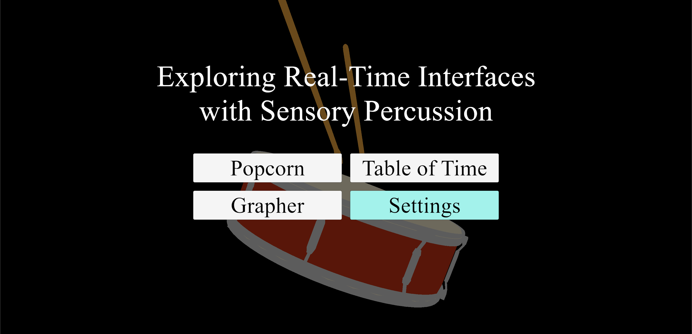
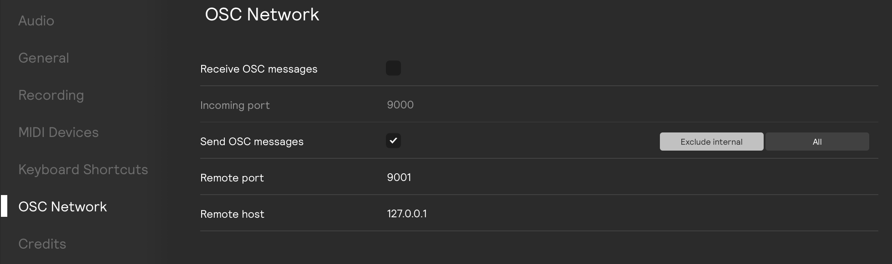

# Exploring Real-time Interfaces with Sensory Percussion

This repository documents an implementation of the **VESPer** system (described in more detail [here]()), and is intended for use alongside [Sensory Percussion 2](https://sunhou.se/sensorypercussion) by Sunhouse and EVANS.

## Requirements

The Unity project was created in version `2022.3.25f1`. It can be opened in more recent versions, though this may increase the build time.

For the most complete experience, users will need the Sensory Percussion 2 software, as well as the accompanying hardware to connect one snare drum.

In lieu of Sensory Percussion 2, users can use [MaxMSP](https://cycling74.com/products/max) and the provided patch to send OSC messages. The Unity project also supports the use of the space key as a drum hit in the center of the head with a velocity of `0.5` (or `64` in MIDI terms) for testing purposes.

## Getting Started

### Unity Demos

The `VESPer Unity Project` folder is the root of the Unity project. The `Assets/Scenes/Demo/Menu` scene is the main menu of the demo project (pictured above).

To connect the Unity project with Sensory Percussion 2, you will need to synchronize the OSC port. You can do this by ensuring that the port number in the Settings menu matches the port number in Sensory Percussion 2:

When properly synchronized, tapping the center of your drum lightly should move between the different highlighted buttons on the main menu.

## Credits

This repository was created as part of work for the [CARDS Lab](https://cards-hci.github.io/) under [Prof. Emily Q. Wang](https://greenteawarrior.github.io/).

The OSC integration is adapted from [https://t-o-f.info/UnityOSC/](https://t-o-f.info/UnityOSC/). **Please note that this is no longer actively maintained.**

#### Models

[Popcorn](https://www.cgtrader.com/3d-models/food/miscellaneous/popcorn-97e6ded8-8b28-48d9-8f29-cd11d2f97808) by [3Dmarkethub on cgtrader](https://www.cgtrader.com/designers/3dmarkethub)

[Snare Drum](https://sketchfab.com/3d-models/snare-low-poly-8ab75d98e94d4ef797b418ce086c5022) by [Murik.3D on Sketchfab](https://sketchfab.com/Murik.3D)